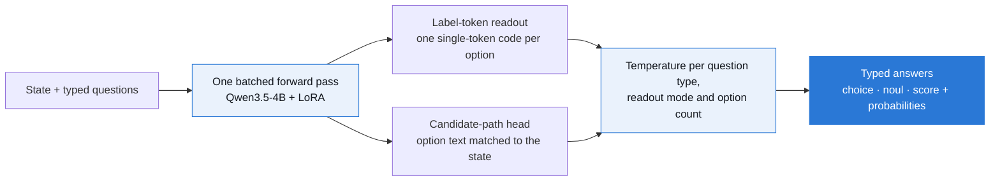

<p align="center">
  
</p>

lev is an open System One decision model and the harness that measures it. Give it a **state** (text, a ticket, an email, or JSON) and a set of typed questions (yes/no, choice, score), and it answers all of them in one forward pass, reading each answer from logits it already computed. It returns calibrated probabilities over exactly the options you supplied and generates no tokens. The model is a LoRA adapter on Qwen3.5-4B; the wire protocol is TypeSafe's `/v1/systemone`, so any TypeSafe client works against it by changing the base URL.

<p align="center"><a href="https://github.com/Abhinavexists/lev/actions/workflows/ci.yml"></a> <a href="LICENSE"></a> <a href="https://huggingface.co/interfaze-ai/lev"></a>  </p>

<h2 align="center">72.5% on S1Bench. 69 ms of compute. 4B parameters.</h2>

<p align="center"><strong>Qwen3.5-4B + LoRA · one H100 · six S1Bench subsets, 1,999 items.</strong><br>Sixth of 22 on the S1Bench board over these subsets, ahead of every model its size or smaller.<br>69 ms is compute inside the container. End to end from a laptop it is 414–463 ms.<br><a href="docs/FINDINGS.md#16-third-run-the-four-gaps-in-the-backbones-chat-format">Accuracy receipt</a> · <a href="docs/DECISIONS.md#adr-023--one-batched-forward-not-prefill-and-fork">Speed receipt</a> · <a href="docs/FINDINGS.md">Every run, measured</a></p>

<p align="center"><a href="#quickstart"><strong>Quickstart</strong></a> · <a href="#why-it-works">Why it works</a> · <a href="#the-optimizations-that-mattered">What mattered</a> · <a href="#measure-it-yourself">Benchmark harness</a> · <a href="#watch-it-decide">Snake demo</a> · <a href="#train-it-yourself">Train it</a> · <a href="docs/DECISIONS.md">Decision log</a> · <a href="https://huggingface.co/interfaze-ai/lev">Model card</a></p>

**No generated tokens. No JSON to parse. No retries until it validates.**

**lev cannot return a label outside your options.** The answer space is the option set you send, so every response is well-formed by construction. lev can still pick the wrong option: this is a structural guarantee, not a guarantee of correctness.

<p align="center"></p>

| subset | task | **lev** | Jev | Qwen3.5-4B, untuned |
|---|---|--:|--:|--:|
| aegis2 | safety moderation | **0.864** | 0.832 | 0.776 |
| boolq | yes/no reading comprehension | 0.880 | **0.910** | 0.860 |
| massive-en-US | intent, 60 classes | 0.791 | **0.814** | 0.734 |
| vitaminc-dev | claim verification | 0.738 | **0.846** | 0.733 |
| paws | adversarial paraphrase | 0.716 | **0.820** | 0.756 |
| helpsteer2 | helpfulness rating | 0.360 | 0.304 | **0.400** |
| **macro** | | 0.725 | **0.754** | 0.710 |

lev and Jev ran through the same harness on the same 1,999 task files. Jev leads on macro accuracy; lev leads on safety moderation (+3.2) and helpfulness rating (+5.6).

> **What the headline means:** accuracy on 6 of S1Bench's 13 subsets, not all of them. At these sizes each subset figure carries roughly ±3–5 points. Our harness scores Jev 2.1 points below its figure on the public board, so lev's placement there is conservative. Jev is ahead by 10.4 and 10.8 points on the two minimal-edit tasks (paws, vitaminc), and its hosted API answered faster end to end from the same laptop (344–357 ms median against lev's 414–463 ms on one Modal H100). [Full runs, per-subset breakdowns and what each run changed →](docs/FINDINGS.md)

<p align="center"></p>

## Quickstart

```bash
pip install "lev[serve] @ git+https://github.com/Abhinavexists/lev#subdirectory=packages/lev"
```

In-process:

```python
import lev

model = lev.load("interfaze-ai/lev")
result = model.system_one(
    "Hi, I was charged twice for my order #4471 and I want a refund.",
    {
        "intent": {
            "type": "choice",
            "instructions": "What does the customer want?",
            "criteria": {
                "refund": "wants money back",
                "cancel": None,
                "track": None,
                "other": None,
            },
        },
        "urgent": {"type": "noul", "instructions": "Does this need a human within the hour?"},
    },
)
result.answers["intent"].choice  # "refund"
result.answers["urgent"].noul  # probability the answer is yes
result.usage.output_tokens  # 0
```

Or as a server, with any TypeSafe client:

```bash
lev serve --checkpoint interfaze-ai/lev --host 0.0.0.0 --port 8000
```

```python
from typesafe_sdk import Choice, Noul, TypeSafeClient

client = TypeSafeClient(base_url="http://localhost:8000", api_key="local", timeout=60)
response = client.system_one(
    state={"ticket": "The app crashes every time I open settings."},
    questions={
        "team": Choice(
            instructions="Which team owns this?", criteria={"billing": None, "technical": None}
        ),
        "bug": Noul(instructions="Is this a bug report?"),
    },
)
```

Python 3.12+, and a CUDA GPU for real-time use. `lev.load` and `lev serve` read the release manifest for the base model, prompt format, calibration and head, so there is nothing to configure. The [model card](https://huggingface.co/interfaze-ai/lev) has the full walkthrough with real outputs.

## Why it works



Each option gets a short code, and the answer is read from the next-token logits over those codes. Choices are read in two option orders and averaged, which cancels position bias. Codes that would split into two tokens are skipped, so label-token readout reaches several hundred options; past that, a small learned head matches the state against each option's text, so there is no fixed option ceiling.

**The router is the part nobody else had.** Every other implementation picks one readout family and hits a wall when options stop fitting in single tokens: it caps the option count or rejects the request. lev routes those questions to the candidate-path head instead. [ADR-005 →](docs/DECISIONS.md#adr-005--dual-mode-readout-the-differentiator)

**Calibration is a first-class objective, not a post-processing step.** Open reproductions reached Jev-level accuracy before they reached its calibration, and the best-calibrated open model got there by fitting a single temperature after training. lev fits one per question type, readout mode and choice option-count band. On a held-out split of the 29 training sources that took expected calibration error from 0.180 to 0.061; the shipped temperatures were then re-selected by how well they carry over to task families left out of the fit. [ADR-006 →](docs/DECISIONS.md#adr-006--calibration-is-the-product) · [ADR-028 →](docs/DECISIONS.md#adr-028--skip-split-label-codes-when-serving-calibrate-for-families-the-model-has-not-seen)

| | An LLM generating JSON | lev |
|:--|:--|:--|
| Output work | Emit the object token by token | Read logits over the option codes |
| Out-of-set labels | Possible; validate and retry | Impossible by construction |
| Probabilities | Not native to sampled text | A calibrated distribution per question |
| Options per question | Bounded by the prompt | Several hundred by label code, unbounded by the head |
| Free text, nested output | Yes | No: finite typed answers only |
| Cross-question reasoning | Later fields can condition on earlier ones | Questions are answered independently |

## The optimizations that mattered

<p align="center"></p>

**One batched forward instead of prefill-and-fork: 169 → 69 ms.** The design prefilled the state once and forked the cache per question. Measured on an H100, the forward pass at this size is bound by kernel launches, not arithmetic, so the fork saved FLOPs and cost time. One batched forward over prefix and suffix per row, plus the depthwise-conv kernel, cut compute by 59%, and it stays flat from one question to eight. `torch.compile` was measured slower on this hybrid model and is off. [ADR-023 →](docs/DECISIONS.md#adr-023--one-batched-forward-not-prefill-and-fork)

**Label-token readout up to the tokenizer's limit: +51 points on massive-en-US.** Training capped label-token readout so the head kept its data, and serving had inherited that cap. Serving 60 options through label codes instead of the head took 60-class intent from 0.231 to 0.746. [ADR-025 →](docs/DECISIONS.md#adr-025--serving-routes-mode-a-up-to-the-tokenizer-limit-training-keeps-its-cap)

**Skipping codes that split: banking77 0.818 → 0.980.** On this tokenizer the 69th code, `BQ`, is two tokens, which capped label-token readout at 68 options. Passing over split codes lifts the limit to several hundred and moved banking77 and clinc_oos (151 intents) onto the stronger readout. [ADR-028 →](docs/DECISIONS.md#adr-028--skip-split-label-codes-when-serving-calibrate-for-families-the-model-has-not-seen)

**The backbone's own prompt format: 0.653 → 0.710 frozen.** The untuned instruct model scores 5.7 points higher on S1Bench when questions are dressed in its chat template, so the final run trained in that format. [ADR-027 →](docs/DECISIONS.md#adr-027--the-prompt-is-dressed-in-the-backbones-own-format)

## Measure it yourself

`levbench` measures lev, Jev, and any `/v1/systemone`-compatible server through the same code path: one changed flag.

```bash
levbench eval  --backend jev                       # the hosted API
levbench eval  --backend lev  --tasks data/eval    # us, on localhost:8000
levbench compare                                   # vs an LLM baseline
levbench sweep                                     # batching economics
levbench confidence                                # which statistic is `confidence`?
```

It reports accuracy, log loss, Brier, **ECE with reliability bins**, selective accuracy, p50 latency, tokens, cost, and schema-retry counts, and it runs offline against a fake transport with no key at all. Omit `--tasks` and you get a built-in 24-item fixture, which is a smoke test: at n=24 the 95% interval is **±16 accuracy points**. `make eval-set` writes the real held-out set and `make s1bench` the S1Bench subsets. [ADR-015 →](docs/DECISIONS.md#adr-015--the-24-item-task-set-is-a-fixture-not-a-benchmark)

`levbench` deliberately does **not** depend on `lev`. A measuring instrument that imports the thing it measures is not an instrument. [ADR-010 →](docs/DECISIONS.md#adr-010--two-packages-one-workspace)

## Watch it decide

The model plays Snake, one `/v1/systemone` call per move: laya-mlx's demo, ported so it runs against any System One server through the same client the benchmark uses.

```bash
uv sync --extra demo
uv run levbench snake --backend planner                        # no server: the planner plays
make snake URL=https://<your-serve-url>                        # lev
uv run levbench snake --backend jev --steps 200 --record artifacts/snake/jev.jsonl
uv run levbench replay artifacts/snake/jev.jsonl              # play it back at original speed
```

The display shows the board, the four direction probabilities with the model's pick marked and unsafe moves flagged, and the model's dead-end-risk and food-reachability estimates beside the planner's ground truth. **By default a planner shield overrules an unsafe first choice** and the display marks it `SHIELD`; `--unassisted` removes the shield, so deaths end the run. In the compact prompt the state text _states_ the Noul answers, so the running Noul score is the cheapest test there is of whether a model reads its question.

## Train it yourself

```bash
make setup     # uv sync, no torch, no GPU
make test      # the full suite: no GPU, no network, no API keys
make plan PRESET=4b-instruct
```

```
model            Qwen/Qwen3.5-4B  (4.0B, bfloat16)
adaptation       LoRA r32
prompt           chat prompts, Mode A to the tokenizer limit
data             200,000 examples x 128 tok x 3 epochs  = 0.08B tokens
steps            18,750 (32 ex/step, ~4,096 tok/step)
compute          2.46e+18 FLOPs
H100 estimate    1.7 hours (0.1 days)
memory           8.3 GB state, 71.7 GB headroom of 80 GB
```

The 128-token figure is measured over 1,500 real rendered prompts, not assumed; `lev plan --data data/mixture` re-measures it against your mixture. Then:

```bash
make setup-train                 # torch, transformers, peft
make data                        # 29 public sources -> train / calibration / test
make smoke-local STEPS=20        # prove the path on 0.8B, on CPU, before spending a GPU
make train PRESET=4b-instruct    # Modal, one H100
make calibrate PRESET=4b-instruct
scripts/publish_hf.sh            # package, load-check on an H100, publish to a private Hub repo
```

The data build refuses any source that resolves to one of the 13 S1Bench subsets. [SETUP.md](docs/SETUP.md) covers Modal, [TRAINING.md](docs/TRAINING.md) the pipeline, and [STATUS.md](docs/STATUS.md) what has been run.

## Boundaries worth understanding

- **Finite typed answers only.** Yes/no, one of N options, or a score over 2–10 levels. No free text, nested schemas or unbounded numbers.
- **Questions are answered independently.** Answers in one request do not condition on each other. Encode a joint decision as one choice, or ask in stages.
- **Minimal-edit pairs.** On paws and vitaminc, two inputs can differ by one swapped word or one changed number, and the model can be confidently wrong there.
- **Calibration is fitted on the training distribution.** Temperatures are chosen to transfer across task families, but a task very unlike the training mix may be less well calibrated. Check on your own data before gating on the probabilities.
- **The S1Bench comparison covers 6 of 13 subsets**, and the lev-vs-Jev calibration comparison has not yet been re-measured with the corrected ECE, so this README makes no claim about it.
- **English only**, and a GPU for real-time use.

## Layout

```
packages/
  lev/          the model     — schema, prompt layouts, router, readouts, calibration, loader, server
  levbench/     the harness   — accuracy, ECE, cost, latency, batching economics, Snake
modal/          app.py        — train / calibrate / serve / check a release on one H100
hf/             README.md     — the Hub model card, and the charts it shows
scripts/        publish_hf.sh — package, load-check and publish a release
docs/           ARCHITECTURE  — the design, and every model it was derived from
                DECISIONS     — one ADR per irreversible choice, with the evidence
                FINDINGS      — what Jev actually is, and every run measured against it
                STATUS        — what is built and how far it has been run
                SETUP, TRAINING — local and Modal, the pipeline step by step
                charts/       — the lev-vs-Jev comparison page, built from the logs
data/           sample state + the S1Bench snapshot the analysis rests on
```

## Prior work

This design is assembled from measured trade-offs in other people's implementations. [ARCHITECTURE.md](docs/ARCHITECTURE.md) dissects each one; the parts taken:

| From | What |
|---|---|
| [reflex](https://github.com/kshetrajna12/reflex) | post-hoc temperature calibration, the cheapest large win |
| [decider](https://github.com/Mapika/decider) | dual prompt layouts, hybrid-attention schema cache, abstain augmentation |
| [simple-jev](https://github.com/featherless-ai/simple-jev) | nine-rating-token Noul |
| [NanoJev](https://github.com/TianyuCodings/NanoJev) | set attention over candidate paths, proper-scoring objectives |
| [litjev](https://github.com/zhengxuyu/litjev) | the reference prefill + logit-readout write-up |
| [jeff](https://github.com/logan-markewich/jeff), [Nimble](https://github.com/bespokelabsai/nimble), [typed-decisions](https://github.com/kotoba-lang/typed-decisions) | encoder and LoRA baselines, and the latency numbers that ruled out diffusion |
| [JEVfire](https://github.com/kikoncuo/jevfire) | the shape of this README |

Benchmark data is a snapshot of a third-party S1Bench dashboard (`data/s1bench-snapshot.json`) that I did not produce; its caveats are in [FINDINGS.md §9](docs/FINDINGS.md).

Not affiliated with or endorsed by TypeSafe AI.

## License

[Apache-2.0](LICENSE). The weights on the Hub carry the same license; some training datasets have their own terms, including non-commercial ones.
